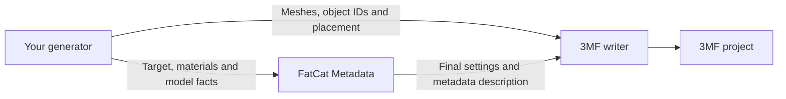

# FatCat Metadata

[](https://github.com/MOVIBALE/fatcat-metadata/actions/workflows/ci.yml)
[](LICENSE)


**Native slicer settings and 3MF metadata for your own model generator.**

FatCat Metadata is a C++17 library with Python bindings. It resolves native
printer, process and material profiles, composes final project settings, and
describes the metadata a 3MF writer needs for a selected slicer.
It can be used independently of Lumina or any other application.

[English](README.md) · [简体中文](README_CN.md) · [API guide](docs/API.md) · [Examples](cpp/examples/python_neroued_consumer/) · [Report an issue](https://github.com/MOVIBALE/fatcat-metadata/issues)

## Project status

The current version is **0.1.0**, an early public SDK. Install from source or
use a verified CI wheel; no tagged release is available yet. Until the first
formal release, record the exact source commit alongside your dependency.

| Language | Current entry point |
| --- | --- |
| C++17 | Standalone static library, public headers and an installable CMake SDK; Python is not required. |
| Python 3.12–3.14 | Compiled bindings to the same C++ core, dictionary/JSON APIs and editor type hints. |
| Other languages | No shipped C ABI or language bindings yet. A bridge to the C++ core is required. |

## What it provides

- Native profile selection by exact slicer version, printer, nozzle, material and build plate.
- Resolution of profile inheritance and includes from bundled upstream JSON snapshots.
- Composition of native projects, user-supplied project settings and merged material slots.
- Preservation of source material identity, temperatures, flow, unknown project fields and recorded provenance.
- Slicer-specific metadata parts, content types, relationships and root-model descriptions for a writer.
- An optional Neroued adapter and independent Python/C++ examples.

## How it fits into a generator



Your generator owns geometry, material choices and placement. FatCat owns
profile selection and metadata composition. The writer assembles and writes
the archive. Metadata uses the writer's real object IDs and material indices;
images and other binary resources remain caller-supplied.

Neroued is optional: the core package has no Neroued runtime dependency, and
another writer can consume the metadata description. FatCat does not perform
slicing or send print jobs.

## Supported slicer snapshots

These are the exact versions currently bundled with the library:

| Application | `slicer_id` | Version |
| --- | --- | --- |
| Bambu Studio | `BambuStudio` | `02.08.02.61` |
| OrcaSlicer | `OrcaSlicer` | `2.4.2` |
| QIDI Studio | `QIDIStudio` | `02.07.02.60` |
| ElegooSlicer | `ElegooSlicer` | `1.5.3.5` |
| Anycubic Slicer Next | `AnycubicSlicerNext` | `2.0.0.2` |
| Flash Studio | `FlashStudio` | `1.7.15` |
| Snapmaker Orca | `SnapmakerOrca` | `2.3.6` |

The [target manifest](compatibility/current-src/translations/supported-targets.json)
is the authoritative version list. Unknown targets and incompatible selections
are rejected. A supported slicer does not imply every printer/nozzle/material/plate
combination is available; inspect its native source catalogue.

Some combinations use explicitly recorded historical sources. OrcaSlicer 2.4.2
U1 0.4 mm, for example, uses a recorded 2.2.4 process and textured-plate material.
The result identifies their actual versions. See [compatibility notes](docs/COMPATIBILITY.md).

## Python quick start

### Install from source

Use Python 3.12–3.14 and a C++17 toolchain. The build uses CMake 3.18 or newer
and fetches pinned JSON/XML dependencies if suitable system packages are absent.

```bash
git clone https://github.com/MOVIBALE/fatcat-metadata.git
cd fatcat-metadata
python -m pip install .
```

For a reproducible integration, check out the reviewed full commit SHA before
building. No installed slicer application is needed to use the bundled data.

### Compose native project settings

```python
import fatcat_metadata as fatcat

result = fatcat.compose_project_settings({
    "project_source": "fatcat_native",
    "slicer_id": "BambuStudio",
    "application_version": "02.08.02.61",
    "machine_uid": "bambu-lab:a1-mini",
    "nozzle_uid": "nozzle:0.4mm",
    "build_plate_uid": "plate:textured-pei",
    "source_materials": [
        {"name": "Bambu PLA Basic", "material_type": "PLA Basic", "colour": "#E63946"}
    ],
})
project = result["project_settings"]
```

Supply the final dictionary and your real model facts to
`compose_model_metadata(project, model_request)` for the writer-facing description.
For a user-provided project, use `compose_project_settings(source_project, request)`.
Existing JSON-string calls remain supported. See the [API guide](docs/API.md)
for both request contracts.

### Write a complete example 3MF

From the source checkout, install the optional writer and run the cube generator:

```bash
python -m pip install 'neroued-3mf==0.4.0'
python cpp/examples/python_neroued_consumer/minimal.py --output fatcat-cube.3mf
```

The [minimal example](cpp/examples/python_neroued_consumer/minimal.py) shows
settings composition, real geometry/ID creation, metadata application and one
archive write. It uses Neroued's public core assembly layout. The
[complete guide](cpp/examples/python_neroued_consumer/README.md) covers custom
sources, U1 compatibility and writer requirements for optional external
production-model layouts.

### Install a prebuilt wheel

Open a successful [CI run](https://github.com/MOVIBALE/fatcat-metadata/actions/workflows/ci.yml),
select the artifact for your OS, architecture and Python version, unzip it,
and install its `.whl`. GitHub sign-in is required to download Actions artifacts.

```bash
python -m pip install "/path/to/fatcat_metadata-0.1.0-<matching-tags>.whl"
```

Replace the sample path with the actual downloaded filename; keep its wheel tags.
CI produces Python 3.12/3.13/3.14 wheels for Linux x64, macOS ARM64 and Windows
x64. Artifacts are retained for **30 days**. Wheel tags must match your platform
and interpreter; Linux wheels use the runner's native tag and do not promise
compatibility with older distributions. Use source installation for other
platforms or expired artifacts.

All current builds are version 0.1.0. Inspect the installed build with:

```python
import fatcat_metadata as fatcat

print(fatcat.__version__)
print(fatcat.__source_revision__)
print(fatcat.__source_dirty__)
```

The revision identifies the actual build checkout; PR CI may use a merge
revision. Git-free archives report `"unknown"` and `None`. These build fields
are separate from the selected profiles' provenance.

## Standalone C++ SDK

Build and install the core without Python. Replace the installation prefix
below with an absolute path on your machine:

```bash
cmake -S cpp -B build-sdk -DCMAKE_BUILD_TYPE=Release \
  -DFATCAT_BUILD_PYTHON=OFF -DFATCAT_BUILD_TESTS=OFF -DFATCAT_INSTALL_CPP=ON
cmake --build build-sdk --config Release --parallel
cmake --install build-sdk --config Release --prefix /absolute/path/to/fatcat-sdk
```

Point your CMake project's `CMAKE_PREFIX_PATH` at that installation, then link
your existing `my_generator` target:

```cmake
find_package(FatCatMetadata 0.1.0 CONFIG REQUIRED)
target_link_libraries(my_generator PRIVATE FatCatMetadata::Core)
```

Pass `FatCatMetadata_DATA_DIR` to the public composition APIs; the library
resolves its internal profile/target paths. System JSON/XML packages used to
build the SDK must also be available to the consumer. Python wheels do not
include this C++ development SDK. See the [C++ guide](cpp/README.md) and
[external CMake consumer](cpp/examples/out_of_tree_consumer/) for complete examples.

## Data and validation

Native profiles are bundled JSON snapshots from the listed slicer releases.
Normal calls read that packaged data; they do not query installed slicers or
download profiles at runtime. Upstream files retain their original content and
inheritance relationships. Library-maintained target contracts and source
indices are separate from those raw profiles.

CI checks C++ Debug/Release builds, Python wheel installation, composition,
independent consumers and generated archive structure on Windows, Linux and
macOS. Native GUI opening/slicing and physical printer behavior require separate
acceptance. See [validation scope](docs/VALIDATION.md) for what each check establishes.

## Documentation and repository layout

| Guide | Purpose |
| --- | --- |
| [API](docs/API.md) | Settings/metadata requests, dictionary and JSON calls, and build provenance. |
| [Python examples](cpp/examples/python_neroued_consumer/README.md) | Complete independent generator and optional writer integration. |
| [C++ SDK](cpp/README.md) | Source builds, installation and downstream CMake consumption. |
| [Compatibility](docs/COMPATIBILITY.md) | Historical profiles and unavailable combinations. |
| [Maintenance](docs/MAINTAINERS.md) | Updating snapshots, target bindings and source provenance. |
| [Validation](docs/VALIDATION.md) | Automated checks and separate native GUI acceptance. |

```text
cpp/            C++ core, public headers, Python bindings and examples
python/         Optional Neroued adapter and Python type signatures
compatibility/  Native profile snapshots, source indices and target contracts
scripts/        Source refresh and installed-package checks
docs/           API, compatibility, maintenance and validation guides
licenses/       Third-party license texts and source manifest
```

## Contributing

Use [Issues](https://github.com/MOVIBALE/fatcat-metadata/issues) for bug reports
and feature proposals, and submit pull requests against `main`. Include the
library source revision, OS, exact slicer version, printer/nozzle/material/plate
selection and a minimal input in reports. Remove private geometry and customer
data before sharing a reproduction.

Keep public interfaces compatible, adopt new helpers in a real consumer and
document behavior changes. Profile updates need exact upstream sources and
license records: follow the [maintenance guide](docs/MAINTAINERS.md). Existing
build/check commands are in the [C++ guide](cpp/README.md) and
[CI workflow](.github/workflows/ci.yml). Record actual application versions and
GUI outcomes separately from CI results.

## License

Original FatCat code is licensed under **AGPL-3.0-only**; see [LICENSE](LICENSE).
Third-party profile data and dependencies retain their respective licenses.
Their sources and notices are recorded in [NOTICE.md](NOTICE.md) and the
[third-party manifest](licenses/third-party/manifest.json).
[COPYRIGHT.md](COPYRIGHT.md) explains copyright ownership and separate licensing
terms for original code. Neroued is a separate project with its own terms.
