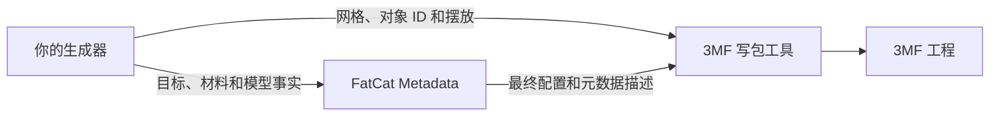

# FatCat Metadata

[](https://github.com/MOVIBALE/fatcat-metadata/actions/workflows/ci.yml)
[](LICENSE)


**为模型生成器提供原生切片软件配置与 3MF 元数据。**

FatCat Metadata 是一个 C++17 库，同时提供 Python 接口。它负责选择原生打印机、
工艺和材料预设，合成最终工程配置，并生成 3MF 写包工具需要的元数据描述。
任何模型生成器都可以独立接入，无需依赖 Lumina 或其他应用。

[English](README.md) · [简体中文](README_CN.md) · [API 指南](docs/API.md) · [示例](cpp/examples/python_neroued_consumer/) · [反馈问题](https://github.com/MOVIBALE/fatcat-metadata/issues)

**首次使用：**[安装、命令行查询与完整 3MF 示例](docs/FIRST_USE.md)。
适用于新生成器接入、保留用户工程调校及合并材料槽位，均调用同一核心。

## 项目状态

当前版本为 **0.1.0**，处于早期公开 SDK 阶段。可从源码安装，或使用通过 CI 检查的
wheel；目前没有带版本标签的正式发行包。首次正式发行前，请在依赖中记录准确的源码提交。

| 语言 | 当前提供的接口 |
| --- | --- |
| C++17 | 独立静态库、公开头文件和可安装的 CMake SDK，不需要 Python。 |
| Python 3.12–3.14 | 调用同一份 C++ 核心的编译扩展，提供字典/JSON 接口及编辑器类型提示。 |
| 其他语言 | 尚未提供 C ABI 或对应语言封装，需要增加与 C++ 核心对接的接口。 |

## 提供的能力

- 按准确的切片软件版本、打印机、喷嘴、材料和打印板选择原生预设。
- 从随库安装的原始 JSON 快照中解析预设继承和包含关系。
- 合成原生工程配置、用户提供的工程配置，以及多个来源的材料槽位。
- 保留来源材料身份、温度、流量、未知工程字段及真实来源信息。
- 生成各切片软件需要的元数据部件、内容类型、关系和根模型描述。
- 提供可选的 Neroued 适配，以及独立 Python/C++ 示例。

## 如何接入生成器



生成器负责几何、材料选择与摆放；FatCat 负责预设选择和元数据合成；
写包工具负责组装并写出文件。元数据使用写包工具真实创建的对象 ID 和材料索引，
图片等二进制资源由调用方提供。

Neroued 是可选集成，FatCat 核心不依赖它运行。其他写包工具也可以采用返回的
元数据描述。FatCat 本身不执行切片，也不发送打印任务。

## 支持的切片软件快照

当前随库安装的是以下准确版本：

| 应用 | `slicer_id` | 版本 |
| --- | --- | --- |
| Bambu Studio | `BambuStudio` | `02.08.02.61` |
| OrcaSlicer | `OrcaSlicer` | `2.4.2` |
| QIDI Studio | `QIDIStudio` | `02.07.02.60` |
| ElegooSlicer | `ElegooSlicer` | `1.5.3.5` |
| Anycubic Slicer Next | `AnycubicSlicerNext` | `2.0.0.2` |
| Flash Studio | `FlashStudio` | `1.7.15` |
| Snapmaker Orca | `SnapmakerOrca` | `2.3.6` |

[目标清单](compatibility/current-src/translations/supported-targets.json)是版本范围的权威来源。
未知目标和不兼容的选择会明确拒绝。支持某款软件不代表其所有机型、喷嘴、材料和打印板
组合都可用；具体选择应查询该软件的原生来源目录。

少数组合采用明确记录的历史配置。例如 OrcaSlicer 2.4.2 的 U1 0.4 mm 使用保留的
2.2.4 工艺和纹理板材料，返回结果会标明实际版本。详见[兼容说明](docs/COMPATIBILITY.md)。

## Python 快速上手

### 安装预编译 wheel

从成功的 [CI 构建](https://github.com/MOVIBALE/fatcat-metadata/actions/workflows/ci.yml)
下载匹配 CPython 3.12–3.14、操作系统和 CPU 的 wheel，替换下方路径。
匹配的 wheel 包含已编译扩展和原生命令，安装时不需要编译 C++。

```bash
python -m pip install "/path/to/fatcat_metadata-0.1.0-<matching-tags>.whl"
fatcat --version
fatcat catalog
```

Actions 下载需要登录 GitHub，普通 CI 附件保留 30 天。项目尚未提供正式 Release 或
PyPI 发行。原生 Linux 构建不承诺兼容更旧的发行版；手动[发行准备流程](docs/DISTRIBUTIONS.md)
使用 manylinux 构建 wheel；macOS wheel 最低版本为 14，C++ SDK 为 13.3，
不会自动发布。

[随包立方体示例](docs/FIRST_USE.md)已在指定版本 Bambu Studio 中真实打开和切片：


截图展示一个示例的配置和切片走线，不代表所有机型组合或实体打印质量全部验收。

无需安装切片软件。可先查询参数候选，再合成工程：

```bash
fatcat choices --slicer BambuStudio --application-version 02.08.02.61 \
  --machine bambu-lab:a1-mini --nozzle nozzle:0.4mm --plate plate:textured-pei
```

### 合成原生工程配置

```python
import fatcat_metadata as fatcat

result = fatcat.compose_project_settings({
    "project_source": "fatcat_native",
    "slicer_id": "BambuStudio",
    "application_version": "02.08.02.61",
    "machine_uid": "bambu-lab:a1-mini",
    "nozzle_uid": "nozzle:0.4mm",
    "build_plate_uid": "plate:textured-pei",
    "source_materials": [
        {"name": "Bambu PLA Basic", "material_type": "PLA Basic", "colour": "#E63946"}
    ],
})
project = result["project_settings"]
```

将最终配置字典和真实模型信息传给 `compose_model_metadata(project, model_request)`，
即可获得供写包工具使用的描述。使用用户工程时，调用
`compose_project_settings(source_project, request)`。原有 JSON 字符串调用方式继续支持。
两类请求的完整说明见 [API 指南](docs/API.md)。

### 写出完整的示例 3MF

安装可选写包工具，然后运行随 wheel 提供的示例，不需要克隆源码：

```bash
python -m pip install 'neroued-3mf==0.4.0'
python -m fatcat_metadata_examples.minimal --output fatcat-cube.3mf
```

[最小示例](cpp/examples/python_neroued_consumer/minimal.py)展示配置合成、真实几何和对象 ID
创建、元数据应用及一次写包，采用 Neroued 的公开核心装配方式。
[完整指南](cpp/examples/python_neroued_consumer/README.md)包含用户来源、U1 兼容案例，
以及可选外部 production 模型布局对写包工具的要求。

### 从源码构建

源码构建需要 C++17 编译工具链、CMake 3.18+ 和 Python 3.12–3.14。
系统没有合适的 JSON/XML 依赖时，会获取固定版本源码。
正式接入时，请先切换到已审核的完整提交 SHA，便于复现。

```bash
git clone https://github.com/MOVIBALE/fatcat-metadata.git
cd fatcat-metadata
python -m pip install .
```

未提供匹配产物或下载已过期时，可使用源码构建。

当前所有构建均标记为 0.1.0。可查看实际安装的构建信息：

```python
import fatcat_metadata as fatcat

print(fatcat.__version__)
print(fatcat.__source_revision__)
print(fatcat.__source_dirty__)
```

源码版本记录实际构建目录的提交，PR CI 可能使用合成的合并提交；
没有 Git 信息的源码包默认返回 `"unknown"` 和 `None`；打包工作流可传入构建来源。
具体规则见[发行文件准备](docs/DISTRIBUTIONS.md)。
这些字段描述库的构建，与所选原生预设的来源信息相互独立。

## 独立 C++ SDK

C++ 核心可以在没有 Python 的情况下构建和安装。
请将以下安装前缀替换为本机的绝对路径：

```bash
cmake -S cpp -B build-sdk -DCMAKE_BUILD_TYPE=Release \
  -DFATCAT_BUILD_PYTHON=OFF -DFATCAT_BUILD_TESTS=OFF -DFATCAT_INSTALL_CPP=ON
cmake --build build-sdk --config Release --parallel
cmake --install build-sdk --config Release --prefix /absolute/path/to/fatcat-sdk
```

在自己的 CMake 项目中通过 `CMAKE_PREFIX_PATH` 指定 SDK 位置，
为已定义的 `my_generator` 目标查找和链接库：

```cmake
find_package(FatCatMetadata 0.1.0 CONFIG REQUIRED)
target_link_libraries(my_generator PRIVATE FatCatMetadata::Core)
```

向公开合成接口传入安装后的 `FatCatMetadata_DATA_DIR`，内部配置路径由库负责解析。
构建 SDK 时采用的系统 JSON/XML 包，在消费者环境中也需要可用。
Python wheel 不包含这套 C++ 开发 SDK。
完整步骤见 [C++ 指南](cpp/README.md)和[外部 CMake 消费者](cpp/examples/out_of_tree_consumer/)。

## 配置数据与验证范围

原生配置是从表中所列软件版本收集的 JSON 快照。日常调用读取随库安装的数据，
不会实时查询本机切片软件或联网下载预设。上游文件保留原始内容与继承关系；
库维护的目标转换规则和来源索引与这些原始预设分别保存。

CI 覆盖 Windows、Linux、macOS 的 C++ Debug/Release、Python wheel 安装、
配置合成、独立消费者及生成包结构。真实 GUI 打开、切片和实体打印行为需要单独验收。
[验证范围](docs/VALIDATION.md)说明各类检查分别能够证明什么。

## 文档与目录

| 指南 | 内容 |
| --- | --- |
| [API](docs/API.md) | 配置/元数据请求、字典与 JSON 调用、构建追溯。 |
| [首次使用](docs/FIRST_USE.md) | 安装后的命令、参数查询和完整立方体示例。 |
| [发行准备](docs/DISTRIBUTIONS.md) | 固定版本、来源和哈希清单；不自动发布。 |
| [Python 示例](cpp/examples/python_neroued_consumer/README.md) | 完整独立生成器及可选写包集成。 |
| [C++ SDK](cpp/README.md) | 源码构建、安装和下游 CMake 接入。 |
| [兼容说明](docs/COMPATIBILITY.md) | 历史来源记录及不可用组合。 |
| [维护指南](docs/MAINTAINERS.md) | 更新配置快照、目标绑定和来源记录。 |
| [验证范围](docs/VALIDATION.md) | 自动检查与独立 GUI 验收。 |

```text
cpp/            C++ 核心、公开头文件、Python 绑定和示例
python/         可选 Neroued 适配和 Python 类型签名
compatibility/  原生配置快照、来源索引和目标转换规则
scripts/        来源更新与安装包检查工具
docs/           API、兼容、维护和验证指南
licenses/       第三方许可证文本及来源清单
```

## 参与贡献

通过 [Issues](https://github.com/MOVIBALE/fatcat-metadata/issues)反馈问题或提出功能建议，
通过面向 `main` 的 PR 提交修改。反馈时请提供库的源码版本、操作系统、准确的切片软件版本、
打印机/喷嘴/材料/打印板选择和最小输入。分享复现材料前，请移除私有几何和客户数据。

修改应保持公开接口兼容，新辅助函数应有实际消费者，并说明行为变化。
配置更新需要准确的上游来源和许可记录，请遵循[维护指南](docs/MAINTAINERS.md)。
现有构建与检查命令在 [C++ 指南](cpp/README.md)和 [CI 工作流](.github/workflows/ci.yml)中。
GUI 验收应单独记录实际应用版本和结果。

## 许可证

FatCat 原创代码采用 **AGPL-3.0-only**，详见 [LICENSE](LICENSE)。
第三方配置数据和依赖保留各自的许可证，来源和声明记录在 [NOTICE.md](NOTICE.md)与
[第三方清单](licenses/third-party/manifest.json)中。
[COPYRIGHT.md](COPYRIGHT.md)说明原创代码的版权归属和另行授权条款。
Neroued 是独立项目，适用其自身条款。
