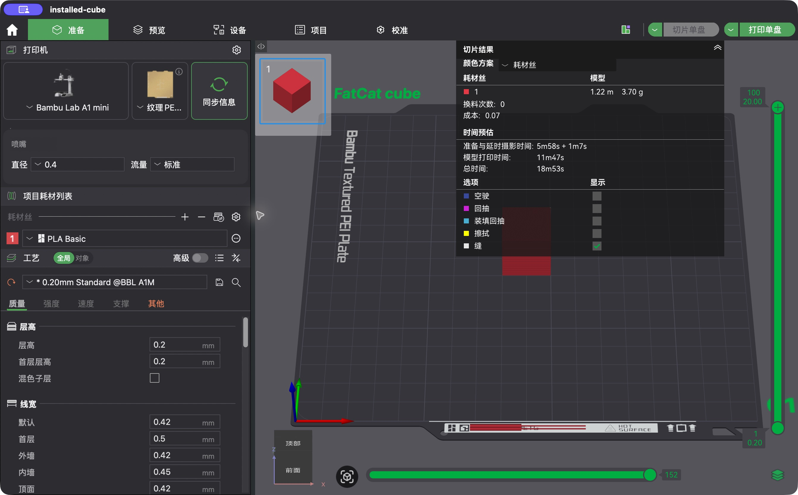

# First result / 首次使用

## Install once / 安装

Download a wheel that matches your OS, CPU and CPython 3.12–3.14 from a successful
build. Use its real filename in place of the example path below. Installing a
matching wheel does not compile C++. There is no PyPI release yet; do not assume
`pip install fatcat-metadata` will fetch this project.

下载与操作系统、CPU 和 CPython 3.12–3.14 匹配的 wheel，将下方路径换成真实文件名。
安装匹配的 wheel 不编译 C++。项目尚未发布到 PyPI。

Prepared macOS wheels target macOS 14+ on Apple Silicon; other target details
are in [DISTRIBUTIONS.md](DISTRIBUTIONS.md). Older CI downloads may require a
newer OS and lack this command; use an artifact built from this implementation.

本轮 macOS wheel 面向 Apple Silicon、macOS 14+；其他目标详见发行说明。
旧 CI 附件可能要求更高系统版本，也没有新命令，需采用本轮代码构建的产物。

```bash
python -m pip install "/path/to/fatcat_metadata-0.1.0-<matching-tags>.whl"
fatcat --version
fatcat catalog
```

`fatcat` launches the native command shipped with the wheel. If your Python
scripts directory is not on PATH, use `python -m fatcat_metadata_cli` instead.
The standalone C++ SDK installs the same executable in `bin/`; it reads the
SDK's sibling `share/fatcat-metadata` directory and requires no Python.

wheel 安装的 `fatcat` 启动同一原生命令。Python 的命令目录未加入 PATH 时，可使用
`python -m fatcat_metadata_cli`。独立 C++ SDK 的 `bin/fatcat` 不需要 Python，
默认读取同一 SDK 下的 `share/fatcat-metadata`。

## Discover choices / 查询候选

```bash
fatcat catalog --slicer BambuStudio --application-version 02.08.02.61
fatcat fields --slicer BambuStudio --application-version 02.08.02.61
fatcat choices --slicer BambuStudio --application-version 02.08.02.61 \
  --machine bambu-lab:a1-mini --nozzle nozzle:0.4mm --plate plate:textured-pei
```

The catalogue lists exact machine/nozzle identities and source availability.
Choices return plate UIDs, process names and material names/types. A material's
`supported_build_plate_uids` uses the composer's existing temperature rule.
Selecting `--plate` also marks incompatible materials unavailable with a reason.
These are candidates from bundled snapshots, not proof of physical compatibility
or an exhaustive list from newer installed slicers. Unknown targets fail rather
than falling back to a similar printer.

目录返回准确机型、喷嘴和来源状态；候选包含板型 UID、工艺名称、材料名称与类型。
指定 `--plate` 后，不支持该板型的材料会标为不可用并说明原因。判断复用合成器现有规则，
不等于实体兼容验收，也不代表更新版本切片软件的全部预设。未知目标会明确报错。

OrcaSlicer U1 0.4 mm reports its recorded 2.2.4 `compatibility_source` separately
from native 2.4.2 candidates. Historical process/materials are not relabelled as
current native presets. `available: true` describes that candidate's source/type/
machine/optional plate checks; final composition still validates all selected facts.

OrcaSlicer U1 0.4 mm 的历史 2.2.4 来源单独显示在 `compatibility_source`，不会冒充
2.4.2 原生候选。`available: true` 描述候选来源、类型、机型及可选板型的检查；
实际合成仍会验证完整请求与材料槽位。

## Compose settings / 合成配置

Save the following UTF-8 JSON as `selection.json`. Preset names returned by
`choices` can be copied into `native_print_profile_name` and per-slot
`native_filament_profile_names` when explicit choices are needed.

将以下 UTF-8 JSON 保存为 `selection.json`。需要明确选择时，可将候选中的名称填写到
`native_print_profile_name` 及逐槽位的 `native_filament_profile_names`。

```json
{
  "project_source": "fatcat_native",
  "slicer_id": "BambuStudio",
  "application_version": "02.08.02.61",
  "machine_uid": "bambu-lab:a1-mini",
  "nozzle_uid": "nozzle:0.4mm",
  "build_plate_uid": "plate:textured-pei",
  "source_materials": [
    {"name": "Bambu PLA Basic", "material_type": "PLA Basic", "colour": "#E63946"}
  ],
  "enable_prime_tower": "0"
}
```

```bash
fatcat compose-settings --request selection.json --output settings.json
```

The JSON result contains `project_settings`, `effective_settings`, provenance
and `metadata_defaults`. For a user source, add `--project source.json` and use
the source request described in [API.md](API.md). To describe model metadata:

返回 JSON 包含最终配置、有效参数、来源及元数据默认值。用户工程可通过 `--project` 传入，
并使用 [API.md](API.md) 中的来源请求。描述模型元数据时调用：

```bash
fatcat compose-metadata --project settings.json --request model-facts.json --output metadata.json
```

`model-facts.json` must describe your writer's real object IDs, parts, material
indexes and placement. `settings.json` can be the composition result above or
plain project settings. Metadata JSON does not contain meshes and is not a 3MF.
Commands write JSON to stdout unless `--output` is given, errors to stderr,
and return 0 on success or 2 on failure. `--data-root` overrides the installed
data location. Output parent directories must already exist.

模型事实必须来自写包工具真实创建的对象与材料槽位。元数据 JSON 不含网格，也不是 3MF。
命令默认将 JSON 写到标准输出，错误写到标准错误；成功退出码为 0，失败为 2。
`--data-root` 可指定数据目录。输出文件的父目录需已存在。

## Generate a complete 3MF / 生成完整 3MF

Install the optional writer and run the example installed by the wheel, without
checking out this repository:

安装可选写包工具，运行随 wheel 安装的示例，不需要克隆源码：

```bash
python -m pip install 'neroued-3mf==0.4.0'
python -m fatcat_metadata_examples.minimal --output fatcat-cube.3mf
```

The example supplies a 20 mm red PLA cube, centers it on the selected A1 mini
bed, creates actual writer IDs, obtains FatCat's metadata and writes once with
Neroued. Open the resulting file in Bambu Studio 02.08.02.61 to inspect those
choices. A successful file write alone does not prove GUI acceptance or slicing.
The example generator owns its geometry; it is outside the metadata core.

示例生成 20 mm 红色 PLA 立方体，按 A1 mini 的真实打印区域居中，创建真实对象 ID，
取得 FatCat 元数据后由 Neroued 写包一次。可在指定版本 Bambu Studio 中打开检查。
文件写出成功不等于 GUI 打开或切片通过。几何属于独立示例生成器，不属于元数据核心。

The installed example was opened and sliced in Bambu Studio 02.08.02.61 on
macOS: A1 mini, 0.4 mm nozzle, textured PEI, red PLA, 0.2 mm layers, 100 layers
and 20 mm height. This is one representative example, not a seven-slicer or
physical-printing acceptance claim. The UI's time and cost are estimates.

已在 macOS 的指定版本软件中真实打开并切片，观察到上述配置、100 层及 20 mm 高度。
这只证明该示例，不代表七个切片软件或实体打印全部验收。界面时间及成本为估算。



Use `python -m fatcat_metadata_examples.write_example --help` for custom
requests and source projects. With a local wheel path, installing
`"/path/to/matching.whl[examples]"` also installs the optional writer.

可用完整示例命令的 `--help` 查询自定义请求和来源工程选项。

For a richer example, use the installed `showcase` command with OrcaSlicer or
Bambu Studio. It reads an editable process JSON and keeps the same geometry
across targets. See the [seven-slicer GUI demonstration](SHOWCASE.md) for the
commands, exact application versions and observed limitations.

更多参数示例可使用随包的 `showcase` 命令，选择 OrcaSlicer 或 Bambu Studio。
它读取可编辑的工艺 JSON，并在不同目标间复用同一几何。
详见[七款软件真实 GUI 演示](SHOWCASE.md)的命令、准确版本及观察限制。

## Why use it? / 适用场景

- A new image/model generator supplies its palette and geometry; FatCat resolves
  the chosen slicer's settings and metadata without importing Lumina.
- An editor preserves user-project temperature/flow and unknown fields through
  the source composer rather than replacing the project with a canned template.
- A merger supplies source slot mappings; the shared composer handles material
  arrays and transition settings in the final slot order.

- 新生成器提供几何和真实材料，FatCat 解析配置并描述元数据，无需接入 Lumina。
- 编辑器通过来源合成保留用户调校和未知字段。
- 合并生成器提供来源槽位映射，共用核心处理最终槽位数组及转换参数。
