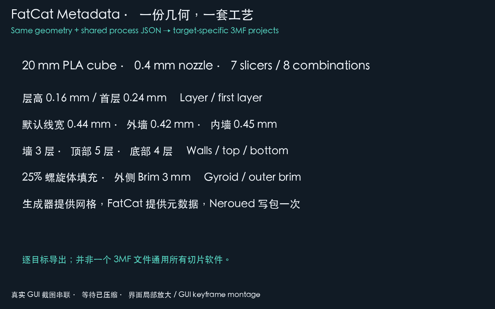

# Custom process in native slicers / 自定义工艺演示

The same 20 mm PLA cube and shared process JSON were exported for eight
printer/slicer combinations and actually opened and sliced on macOS on
2026-10-05. No process value was changed in the GUI to make slicing pass.
The animation is a **136-second GUI keyframe montage**, with waiting compressed
and parameter/result panels enlarged. It is not uninterrupted screen recording.

同一个 20 mm PLA 立方体与同一份工艺 JSON，分别导出八组打印机/切片软件工程，
已于 2026-10-05 在 macOS 真实打开并切片。没有在 GUI 中改工艺参数来绕过报错。
动图长 **136 秒**，由真实界面截图串联，压缩等待并放大参数与结果区域，
不是连续屏幕录像。它展示元数据进入原生软件后的实际效果。



## Reproduce / 复现

Install a matching FatCat wheel from the reviewed source revision and the
optional writer. See [FIRST_USE.md](FIRST_USE.md) for wheel selection/source
installation. No Lumina checkout or installed slicer is needed to generate files.
The recorded exports used CPython 3.14 and the public Neroued 0.4.0 core layout.

安装与环境匹配、由本轮源码构建的 FatCat wheel 及可选写包工具。
安装方法见首次使用说明；生成不需要 Lumina 或本机安装的切片软件。
本轮导出采用 CPython 3.14 和公开 Neroued 0.4.0 的核心模型布局。

```bash
python -m pip install "/path/to/matching-fatcat-wheel.whl" 'neroued-3mf==0.4.0'
python -m fatcat_metadata_examples.showcase \
  --slicer OrcaSlicer --machine bambu-lab:a1-mini --output orca-a1-mini.3mf
python -m fatcat_metadata_examples.showcase \
  --slicer OrcaSlicer --machine bambu-lab:p1s --output orca-p1s.3mf
python -m fatcat_metadata_examples.showcase \
  --slicer BambuStudio --machine bambu-lab:p1s --output bambu-p1s.3mf
```

These commands select the exact slicer snapshot packaged by FatCat, a 0.4 mm
nozzle, textured PEI request and one native PLA material. Each target gets a
separate 3MF with its own metadata; one file is not universally interchangeable.
The generator creates/centers the geometry and real writer object IDs, FatCat
composes settings/metadata, and Neroued writes the archive once.

命令选择 FatCat 随包的准确切片软件版本、0.4 mm 喷嘴、纹理 PEI 请求和一个原生
PLA 材料。每个目标分别生成带对应元数据的 3MF，不是一份文件通用所有软件。
示例生成器创建并居中几何、取得真实对象 ID，FatCat 合成配置和元数据，Neroued 写包一次。

### Editable process / 可编辑工艺

Copy [showcase_process.json](../cpp/examples/python_neroued_consumer/showcase_process.json)
to `my-process.json`, edit the native process fields, and pass
`--process-json my-process.json`. The installed example's defaults are:

复制工艺 JSON、编辑原生字段，通过 `--process-json my-process.json` 传入。
随包默认值如下：

| Setting / 参数 | Requested value / 请求值 |
| --- | --- |
| Layer / first layer height / 层高与首层 | 0.16 / 0.24 mm |
| Default / first-layer width / 默认与首层线宽 | 0.44 / 0.50 mm |
| Outer / inner wall width / 外墙与内墙线宽 | 0.42 / 0.45 mm |
| Walls / wall loops / 墙层数 | 3 |
| Top / bottom shell layers / 顶部与底部层数 | 5 / 4 |
| Sparse infill / 稀疏填充 | 25%, gyroid / 螺旋体 |
| Brim / 附着裙边 | Outer only, 3 mm / 仅外侧，3 mm |
| Support / prime tower / 支撑与擦拭塔 | Disabled / 关闭 |

Both native spellings of first-layer height are included for the bundled
dialects. Some requested widths/top-layer values equal a target's native
defaults; the 16 JSON entries are not 16 proven changes. Native minimum shell
thickness can add layers beyond the configured count. Temperatures, material
flow and other machine/process defaults remain native values in this example.
The `.settings.json` beside each export records requested and composed values,
source provenance and model facts; it is not a substitute for GUI observations.

JSON 同时包含各方言的两种首层字段。部分线宽、顶部层数本来就是某目标的默认值，
16 个条目不代表 16 个值全被改动。原生最小壳厚可使实际壳层数增加。
示例中的温度、材料流量及其他默认值取自原生预设。旁边的 `.settings.json` 记录请求、
合成结果、来源与模型事实，不能用读回该文件代替 GUI 验收。

## Observed matrix / 实测矩阵

All eight files opened and completed slicing. Each preview showed 124 layers,
0.24 mm first layer and 19.92 mm final layer height. Time/material are the
application's estimates, not measured printer results. Recorded values are
not benchmarks between machines.

八份文件均打开并完成切片，预览显示 124 层、首层 0.24 mm、最后一层高度 19.92 mm。
时间及材料量是软件估算，不是实体打印测量，也不用于机型性能比较。

| Application / 软件 | Version / 版本 | Printer / 机型 | Slice / 切片 | Estimated total / 总估算 |
| --- | --- | --- | --- | --- |
| OrcaSlicer | 2.4.2 | Bambu Lab A1 mini | Completed / 完成 | 25m08s, 4.95g |
| OrcaSlicer | 2.4.2 | Bambu Lab P1S | Completed / 完成 | 20m02s, 4.97g |
| Bambu Studio | 02.08.02.61 | Bambu Lab P1S | Completed / 完成 | 18m24s, 4.97g |
| QIDI Studio | 02.07.02.60 | QIDI Q2 | Completed / 完成 | 19m34s, 4.86g |
| ElegooSlicer | 1.5.3.5 | Centauri Carbon | Completed / 完成 | 15m05s, 5.28g total |
| Anycubic Slicer Next | 2.0.0.2 | Kobra S1 | Completed / 完成 | 18m55s, 4.78g |
| Snapmaker Orca | 2.3.6 | Snapmaker U1 | Completed / 完成 | 14m06s, 5.14g |
| Flash Studio | 1.7.15 | Flashforge AD5X | Completed / 完成 | 20m18s, 4.89g |

Other five exports use the same command, with these exact identities. The two
explicit material preset names were selected from the native catalogue:

其他五组使用同一命令及以下身份；两处显式材料名取自原生目录：

```bash
python -m fatcat_metadata_examples.showcase \
  --slicer QIDIStudio --machine qidi:q2 --output qidi-q2.3mf
python -m fatcat_metadata_examples.showcase \
  --slicer ElegooSlicer --machine elegoo:centauri-carbon --output elegoo-centauri-carbon.3mf
python -m fatcat_metadata_examples.showcase \
  --slicer AnycubicSlicerNext --machine anycubic:kobra-s1 --output anycubic-kobra-s1.3mf
python -m fatcat_metadata_examples.showcase \
  --slicer SnapmakerOrca --machine snapmaker:u1 \
  --filament-profile 'Snapmaker PLA Basic @U1' --output snapmaker-u1.3mf
python -m fatcat_metadata_examples.showcase \
  --slicer FlashStudio --machine flashforge:ad5x \
  --filament-profile 'Flashforge PLA Basic @FF AD5X' --output flash-ad5x.3mf
```

## Notices and limits / 提示与限制

- Bambu Studio warned that the connected local device differed from the P1S
  project. Choosing "later" kept the project machine for offline slicing.
- Snapmaker Orca displayed its generic custom-preset G-code notice on import.
  It was acknowledged without disabling future notices or changing presets.
- QIDI/Anycubic composed files requested and contained `Textured PEI Plate`,
  but the GUI showed `Cool Plate`. Their slices completed; plate interpretation
  remains **unverified** here. The montage does not claim that selection passed.
- Some native process names mention a different member of the same profile
  family (for example Flash Studio's inherited AD5M Pro process). The actual
  hardware shown was AD5X; process name alone is not a hardware identity check.
- This sample does not verify all machines/materials, arbitrary overrides,
  custom filament temperature/flow, re-save round trips or physical printing.
  No print job was sent. All applications opened for this run were closed and
  demo preset changes discarded after evidence capture.

- Bambu Studio 提示当前连接设备与 P1S 工程不同；选择“稍后”保留工程机型做离线切片。
- Snapmaker Orca 显示自定义预设的通用 G-code 提示；确认后切片，没有禁用后续提示或改预设。
- QIDI/Anycubic 的请求和文件均为纹理 PEI，但界面显示 Cool Plate；切片完成，
  **板型解释未验证通过**，动图不将其标为通过。
- 部分原生工艺名来自同系列其他机型，例如 Flash 的 AD5M Pro 工艺名；真实硬件显示为
  AD5X，不能只依据工艺名称判断硬件身份。
- 不涵盖全部机型/材料、任意参数覆盖、自定义材料温度/流量、重新保存往返或实体打印。
  没有发送打印任务；本轮启动的软件已关闭，演示产生的临时预设改动已丢弃。
